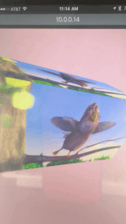

# AFrame Video Shader

A shader to display video for [A-Frame](https://aframe.io) VR. Inspired by [@Jam3](https://github.com/Jam3)'s [ios-video-test](https://github.com/Jam3/ios-video-test)


**[DEMO](https://mayognaise.github.io/aframe-video-shader/basic/index.html)**


**This was made for inline video playback for iPhone. If you only support desktop/android, please use [`flat`](https://aframe.io/docs/core/shaders.html#Flat-Shading-Model) instead for better performance.**





## Properties

- Basic material's properties are supported.
- The property is pretty much same as `flat` shader besides `repeat`. Will update it soon.
- `autoplay` will be useful when [Method](#method) is ready.
- **`muted` is currently always true.** Will be supported soon.
- **`loop` is currently always true.** Will be supported soon.
- `filter` property will be supported soon.

| Property | Description | Default Value |
| -------- | ----------- | ------------- |
| src | image url. @see [Textures](https://aframe.io/docs/components/material.html#Textures)| null |
| autoplay | play automatecally once it's ready| true |
| preload | preload video (this works for only desktop)| true |
| muted | mute or unmute| true (**currently always true.**) |
| loop | loop video| true (**currently always true.**) |
| fps | video fps| 60 |
| volume | video volume | undefined |

For refference, please check the following links:
- [Material](https://aframe.io/docs/components/material.html)
- [Textures](https://aframe.io/docs/components/material.html#Textures)
- [Flat Shading Model](https://aframe.io/docs/core/shaders.html#Flat-Shading-Model)


[MediaElement properties](https://developer.mozilla.org/en-US/docs/Web/API/HTMLMediaElement#Properties) will be supported soon.


## Method

[MediaElement methods](https://developer.mozilla.org/en-US/docs/Web/API/HTMLMediaElement#Methods) will be supported soon.


## Events


[Media events](https://developer.mozilla.org/en-US/docs/Web/Guide/Events/Media_events) will be supported soon.


## Usage

### Browser Installation

Install and use by directly including the [browser files](dist):

```html
<head>
  <title>My A-Frame Scene</title>
  <script src="https://aframe.io/releases/0.2.0/aframe.min.js"></script>
  <script src="https://rawgit.com/mayognaise/aframe-video-shader/master/dist/aframe-video-shader.min.js"></script>
</head>

<body>
  <a-scene>
    <a-entity geometry="primitive:box;" material="shader:gif;src:url(nyancat.gif);color:green;opacity:.8"></a-entity>
  </a-scene>
</body>
```

### NPM Installation

Install via NPM:

```bash
npm i -D aframe-video-shader
```

Then register and use.

```js
import 'aframe'
import 'aframe-video-shader'
```


